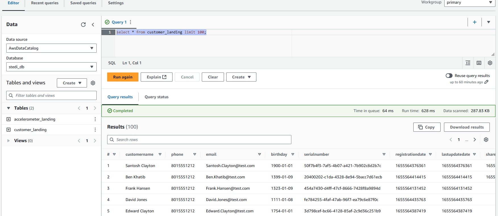
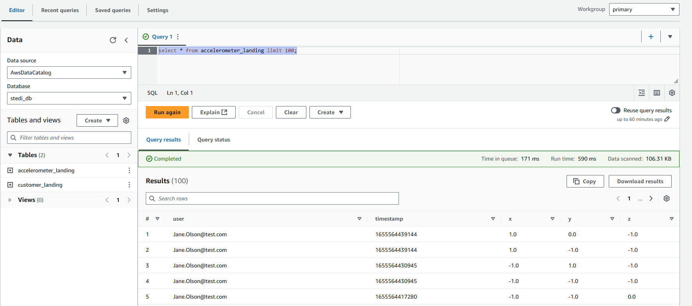
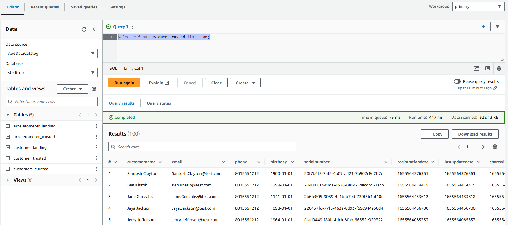

# Project: STEDI Human Balance Analytics

## Overview

Spark and AWS Glue enable the processing of data from various sources, allowing for its categorization and preparation for future queries. As a data engineer with the STEDI Step Trainer team, your role will involve extracting data from the STEDI Step Trainer sensors and the mobile app, and organizing this data into an AWS data lakehouse. This will facilitate Data Scientists in training the learning model.

## Project Summary

The STEDI Team has developed a hardware STEDI Step Trainer that:

- Trains users in a STEDI balance exercise.
- Features sensors that collect data to train a machine-learning algorithm for step detection.
- Includes a mobile app that gathers customer data and interacts with the device's sensors.

STEDI has received positive feedback from millions of early adopters eager to purchase and use the STEDI Step Trainer.

Several customers have already started using their Step Trainers and the mobile app together to test their balance. The Step Trainer functions as a motion sensor, recording the distance of detected objects, while the app utilizes the mobile phone's accelerometer to track motion along the X, Y, and Z axes.

The STEDI team aims to leverage the motion sensor data to train a real-time machine learning model for accurate step detection. Privacy will be a key factor in determining the data that can be utilized.

Some early adopters have consented to share their data for research purposes. Only the Step Trainer and accelerometer data from these customers should be included in the training dataset for the machine learning model.

## Implementation

### Landing Zone

**Glue Tables**:

- [customer_landing.sql](scripts/customer_landing.sql)
- [accelerometer_landing.sql](scripts/accelerometer_landing.sql)

**Athena**:
Results of Landing Zone data queries

_Customer Landing_:

<figure>
  
</figure>

_Accelerometer Landing_:

<figure>
  
</figure>

### Trusted Zone

**Glue Job Scripts**:

- [customer_landing_to_trusted.py](scripts/customer_landing_to_trusted.py)
- [accelerometer_landing_to_trusted_zone.py](scripts/accelerometer_landing_to_trusted.py)

**Athena**:
Results of Trusted Zone queries:

<figure>
  
</figure>

### Curated Zone

**Glue Job Scripts**:

- [customer_trusted_to_curated.py](scripts/customer_trusted_to_curated.py)
- [trainer_trusted_to_curated.py](scripts/trainer_trusted_to_curated.py)

## Data Statistics

- **Landing Zone**

  - Customer: 956
  - Accelerometer: 81,273
  - Step Trainer: 28,680

- **Trusted Zone**

  - Customer: 482
  - Accelerometer: 40,981
  - Step Trainer: 14,460

- **Curated Zone**
  - Customer: 482
  - Machine Learning: 43,681

---
